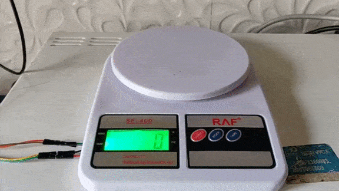

# Automated Calorie Tracking


This repository accompanies the blog post here: 
https://techtalk.digitalpress.blog/automated-calorie-tracking. 


This code for this repository helps capture a food image via your Pi Camera, and classify it using TFLite. 



The food item along with its weight is then logged to HealthifyMe.


## Instructions

To run this on your Raspberry device:

1. Clone this repository
    ```
    git clone https://github.com/lezwon/automatic-calorie-tracking.git
    ```
2. Install requirements
    ```
    pip install -r requirements.txt
    ```
3. Run the main.py file
    ```
    python main.py
    ```